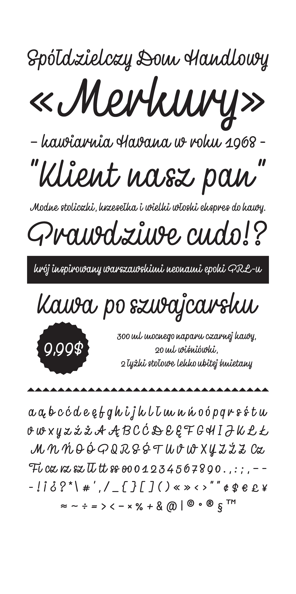

Warsaw Types presents:

### Havana

“Havana” font i inspired by Warsaw neon signs from before 1989. Just like the lettering of that period, the “Havava” design is detail oriented, coherent and sophisticated. Some letters are directly drawn from specific signs – letters “K” and “m” from “Kosmetyki” or letter “t”  from “Mister” sign. The font’s name itself refers to a former cafe “Havana” in Warsaw.

 

### Licence

[SIL Open Font ](http://scripts.sil.org/OFL_web)

Copyright ©  2016 Stowarzyszenie Kulturotwórcze Miastodwa

### About the Author

**Joanna Angulska**

Graduated from the Graphic and Communication Design Dept. on Poznań Fine Arts University. Specializes in logo, layout and branding design. Participant and a speaker in “Plaster” and “Typolub” conferences.

[Behance](https://www.behance.net/JoannaAngulska)

### About Warsaw Types

Warsaw Types is a series of typographic research and design workshops, that took place in 2016 in Warsaw. The result is 12 new typefaces, inspired by the Warsaw’s local urban typographic heritage, that until now, has gone largely unexplored. Fonts were created by young designers, who worked under the guidance of top most experienced Polish typographers and researchers.

The goal of Warsaw Types is to contribute high quality, original fonts to the open source community. But we also want to put a spotlight on the vanishing handmade typo culture, which in our opinion is worth preserving and can become a fresh resource of design inspiration. During the research phase, participants took onto the streets to explore and document the most interesting cases of handcrafted signage, modernist neons, stone engravings, vintage murals, etc. This exploration, supported by archives, became the inspiration for new typefaces.

All effects of our work will be available for free and for everyone to use on our website: [kroje.org](http://kroje.org)

Workshop mentors:

Michał Jarociński
Viktoriya Grabowska
Łukasz Dziedzic
Adam Twardoch
Jan Franciszek Cieślak
Rene Wawrzkiewicz

Guest speakers:

Jarosław Zieliński
Agata Szydłowska

------

Warsaw Types project  is organised and coordinated by:

 [Miastodwa Culturemaking Association](https://www.facebook.com/miastodwa/). 

------

 The project is run in cooperation with, and cofunded by [The City of Warsaw](http://www.um.warszawa.pl/). 

------

Partners: 
[The City of Warsaw](http://www.um.warszawa.pl/), [Muzeum Warszawy](http://muzeumwarszawy.pl/), [Warexpo](http://www.warexpo.pl/), [Transparent Shopping Collective](http://transparentshopping.com/)

 

------

Media Partners: 

[Design Magazyn](http://www.designmagazyn.pl/), [Magazyn Miasta](http://publica.pl/kategoria-produktu/magazyn-miasta), [Gazeta Wyborcza Warszawa](http://warszawa.wyborcza.pl/), [Monitor Magazine](http://monitor-magazine.com/), [Notes na 6 Tygodni](http://notesna6tygodni.pl/), [Pańska Skórka](http://www.panskaskorka.com/)

